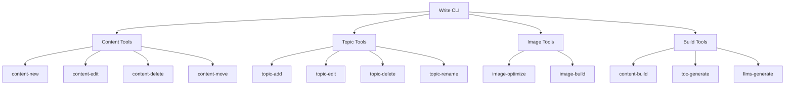

# Content Management System Architecture

This document provides a high-level overview of how the various tools in this content management system work together to provide a complete solution for managing and publishing content.

## System Overview



## Tool Organization

### 1. Primary Interface

The `write` tool serves as the main entry point, providing:

- Interactive CLI interface
- Command routing
- Configuration management
- Common functionality

### 2. Content Management Tools

Tools for managing content lifecycle:

- `content-new`: Content creation
- `content-edit`: Content modification
- `content-move`: Content organization
- `content-delete`: Content removal
- `content-search`: Content discovery
- `content-stats`: Content analytics
- `content-validate`: Content validation

### 3. Topic Management Tools

Tools for organizing content:

- `topic-add`: Topic creation
- `topic-edit`: Topic modification
- `topic-rename`: Topic reorganization
- `topic-delete`: Topic removal

### 4. Image Management Tools

Tools for handling visual assets:

- `image-optimize`: Image optimization
- `image-build`: Responsive image generation

### 5. Build Tools

Tools for generating production assets:

- `content-build`: Content compilation
- `toc-generate`: Navigation structure
- `llms-generate`: AI training data

## Common Libraries

Shared components used across tools:

### Models (`common-models`)

- Content structures
- Topic definitions
- Build configurations
- Cache management

### Error Handling (`common-errors`)

- Standard error types
- Error formatting
- Result handling

### Configuration (`common-config`)

- Configuration parsing
- Environment handling
- Default settings

## Data Flow

1. **Content Creation**

   ```
   content-new → content validation → metadata generation → file creation
   ```

2. **Content Editing**

   ```
   content-edit → content validation → change tracking → file updates
   ```

3. **Build Process**
   ```
   content-build → asset optimization → format conversion → output generation
   ```

## File Structure

```
project/
  ├── content/           # Source content
  │   └── [topic]/
  │       └── [slug]/
  │           ├── index.mdx
  │           ├── metadata.yml
  │           └── assets/
  ├── public/           # Built content
  │   ├── content/
  │   ├── topics/
  │   ├── images/
  │   └── api/
  └── tools/           # Rust tools
      ├── write/
      ├── content-*/
      ├── topic-*/
      ├── image-*/
      └── common/
```

## Development Guidelines

1. **Tool Independence**

   - Each tool should be self-contained
   - Use common libraries for shared functionality
   - Maintain consistent interfaces

2. **Error Handling**

   - Use common error types
   - Provide detailed error messages
   - Implement proper error recovery

3. **Performance**

   - Implement caching where appropriate
   - Use incremental builds
   - Optimize asset processing

4. **Testing**
   - Unit test each tool
   - Integration test tool combinations
   - Validate build outputs

## Configuration

All tools share a common configuration system:

```yaml
# .write.yaml
content:
  root: "./content"
  output: "./public"
topics:
  allow_nested: true
  require_description: true
images:
  optimize: true
  formats: ["webp", "jpg"]
build:
  incremental: true
  cache_timeout: 3600
```

## Workflow Examples

1. **Creating New Content**

   ```bash
   write content new
   write content edit
   write content build
   ```

2. **Managing Topics**

   ```bash
   write topic add
   write topic edit
   write content move
   ```

3. **Building for Production**
   ```bash
   write image optimize
   write content build
   write toc-generate
   ```

## Testing Architecture

### Test Organization

The Write CLI project follows a standardized approach to test organization to ensure maintainability and clarity. Tests are organized into three main categories:

1. **Unit Tests**: Test individual components in isolation, usually located in the same file as the code or in a `tests/unit` directory.
2. **Integration Tests**: Test interactions between multiple components, located in a `tests/integration` directory.
3. **Property-Based Tests**: Test invariants and properties, located in a `tests/property` directory.

#### Test Directory Structure

```
component-name/
  ├── src/
  │    ├── lib.rs
  │    └── module.rs
  └── tests/
       ├── unit/
       │    └── module_tests.rs
       ├── integration/
       │    └── workflow_tests.rs
       └── property/
            └── module_properties.rs
```

#### Test Tagging

Tests can be tagged for selective execution using Cargo features:

```rust
// For tests that work with the file system
#[cfg(test)]
#[cfg_attr(feature = "fs_tests", test)]
fn test_file_operations() {
    // Test code
}
```

#### Helper Macros

The common-test-utils crate provides helper macros for cleaner tests:

```rust
// Using fixtures
with_test_fixture!(fixture => {
    // Test code using fixture
});

// Using mocks
with_mock!(MockFileSystem, mock_fs => {
    // Test code using mock_fs
});

// Property testing
test_property!(
    inputs = inputs,
    property = |input| property(input),
    description = "Property description"
);
```

#### Naming Conventions

- Unit test methods: `test_<function_name>_<scenario_description>`
- Integration test methods: `test_<workflow/feature>_<scenario_description>`
- Property test methods: `prop_<function/feature>_<property_description>`

For more details, see [TEST_ORGANIZATION.md](TEST_ORGANIZATION.md).

### Tool Isolation

All tools in the Write CLI ecosystem are designed to be independently testable following the principles outlined in [TOOL_ISOLATION.md](TOOL_ISOLATION.md).

### Mocking Strategy

The Write CLI uses a consistent approach to mocking, using Mockall for trait-based mocking as described in [MOCKING_GUIDE.md](MOCKING_GUIDE.md).
